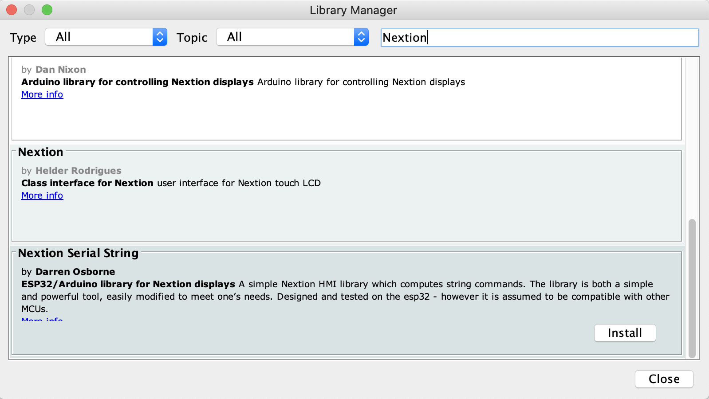
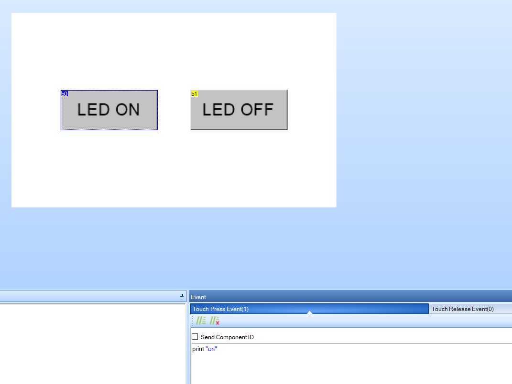

# NextionSerialString

## Description
A simple Nextion HMI library which computes string commands. The library is both a simple and powerful tool, easily modified to meet one’s needs. Designed and tested on the esp32 - however it is assumed to be compatible with other MCUs.

Feel free to support my work! If you found this code useful and it saved you some time and effort, send a small sum of appreciation (to the value you think it is worth)
to my paypal, via this link: (https://paypal.me/ozzyimagesdonate)

## Installation

### First Method **(Coming Soon)**
1.  In the Arduino IDE, navigate to Sketch > Include Library > Manage Libraries
2.  In the Library Manager you will find a list of libraries that are already installed, or ready for installation.
3.  Search for NextionSerialString using the search bar.
4.  Click on the text area and select the latest version to install.



### Second Method
1. Download the latest release of the NextionSerialString library from: [https://github.com/darrenjcosborne/NextionSerialString](https://github.com/darrenjcosborne/NextionSerialString)
2. Extract the `.zip` file 
3. Copy the NextionSerialString folder, to: ....\Arduino\libraries\

***NOTE***: The `.HMI` and `.TFT` files for the Nextion Editor/Display are also included in the example folder.
The `.HMI` file was designed for the Nextion NX4024T032_011 3.2" Basic Display.

## A Simple Setup

### NextionConfig.h

1. Define each of the parameters according to your preferred settings
````Cpp
#define NEXSERIAL Serial2     // Define serial communication channel
#define BAUD 115200     // Define baud rate. esp32 uses a baud rate of 115200
#define RX 16     // Define receiving data pin (RX)
#define TX 17     // Define transmission data pin (TX)
````
### NextionSerialString.ino

1.  **Include** ***NextionSerialString*** and create an object of `NextionSerialString` class
````Cpp
#include "NextionSerialString.h"      // Include NextionSerialString Library
#include "NextionConfig.h"      // Include NextionConfig
````
2.  **Begin the object** using parameters from `NextionConfig.h`
````Cpp
NextionSerialString myNextion(NEXSERIAL, BAUD, RX, TX);    // Initialise connection object                  
````
3.  **Place** the **begin()** function in the setup
````Cpp
void setup(){
  myNextion.begin();     // This function must be called to reset the baud rate on the Nextion, to match that of the esp32
}
````
4. **Place** the **listen()** function in the loop
````Cpp
void loop(){
  myNextion.listen();      // This function must be called repeatedly to respond to touch events from the Nextion panel
}
````

### GUIFunctions.cpp

1. **Create any custom function** from this point on to read the incoming serial data
````Cpp
_serial->println(_serialData);      // Prints the string data received from the Nextion

/*!
  * Put your code here and create any custom function to read the incoming serial data
  * Utilise the string.h library for optimal efficiency
  */
````
### Please note
When compiling and uploading, ***ensure the transmission (TX) cable*** from the Nextion Display is ***NOT connected*** to the receiving (RX) pin of the esp32, otherwise it will timeout.

Enjoy the NextionSerialString Library! :)


## Full Example Code (BlinkSketch.ino)

### NextionConfig.h
````Cpp
/*!
 * NextionConfig.h - Configuration Library for Serial Communication between ESP32 & Nextion Display using strings
 * Copyright (c) 2020 Darren Osborne < darren@ozzyimages.com >
 * All rights reserved under the library's licence
 */

// Define library only once
#ifndef NextionConfig_h
#define NextionConfig_h

#include <arduino.h>

#define NEXSERIAL Serial2     // Define serial communication channel
#define BAUD 115200     // Define baud rate. esp32 uses a baud rate of 115200
#define RX 16     // Define receiving data pin (RX)
#define TX 17     // Define transmission data pin (TX)
#define LEDPIN 4     // Define the esp32 onboard blue led

#endif
````

### BlinkSketch.ino
````Cpp
/*!
 * BlinkSketch.ino - Ozzy Images NextionSerialString Simple Example Code
 * Copyright (c) 2020 Darren Osborne < darren@ozzyimages.com > 
 * All rights reserved under the library's licence
 */

#include <arduino.h>
#include "NextionSerialString.h"      // Include NextionSerialString
#include "NextionConfig.h"      // Include NextionConfig

NextionSerialString myNextion(NEXSERIAL, BAUD, RX, TX);    // Create an object of NextionSerialString class with the name < myNextion >

void setup(){
  pinMode(LEDPIN, OUTPUT);
  myNextion.begin();       // This function must be called to reset the baud rate on the Nextion, to match that of the esp32
}

void loop(){  
  myNextion.listen();        // This function must be called repeatedly to respond to touch events from the Nextion panel
}
````

### HMIFunctions.cpp
````Cpp
/*!
 * HMIFunctions.cpp - Function Handler between ESP32 & Nextion Display
 * Copyright (c) 2020 Darren Osborne < darren@ozzyimages.com >
 * All rights reserved under the library's licence
 */

#include <arduino.h>
#include <string.h>
#include "NextionSerialString.h"      // Include NextionSerialString
#include "NextionConfig.h"      // Include NextionConfig

/*!
 * Function handler which reads the incoming serial data and hands off to a custom function
 * Separated from NextionSerialString.cpp in order to see code modifications/custom functions more clearly
 */
void NextionSerialString::_handleData(String _serialData){
  if(_serialData != ""){      // Check for blank string
    if(_serialData == "on"){
      digitalWrite(LEDPIN, HIGH);
      _serial->println("Turning the onbaord ESP32 blue led ON");
    }else if(_serialData == "off"){
      digitalWrite(LEDPIN, LOW);
      _serial->println("Turning the onbaord ESP32 blue led OFF");
    }else{
      // Do nothing
    } 
  }
}
````

### BlinkSketch.hmi



**Touch Press Event** code for each button is as follows:
````Cpp
print "on"      // Button b0
print "off"     // Button b1
````

## Compatibility
* ESP32
* Arduino (assumed)

Tested MCUs:
1. ESP32

## Licence
MIT License

Copyright (c) 2020 darrenjcosborne

Permission is hereby granted, free of charge, to any person obtaining a copy
of this software and associated documentation files (the "Software"), to deal
in the Software without restriction, including without limitation the rights
to use, copy, modify, merge, publish, distribute, sublicense, and/or sell
copies of the Software, and to permit persons to whom the Software is
furnished to do so, subject to the following conditions:

The above copyright notice and this permission notice shall be included in all
copies or substantial portions of the Software.

THE SOFTWARE IS PROVIDED "AS IS", WITHOUT WARRANTY OF ANY KIND, EXPRESS OR
IMPLIED, INCLUDING BUT NOT LIMITED TO THE WARRANTIES OF MERCHANTABILITY,
FITNESS FOR A PARTICULAR PURPOSE AND NONINFRINGEMENT. IN NO EVENT SHALL THE
AUTHORS OR COPYRIGHT HOLDERS BE LIABLE FOR ANY CLAIM, DAMAGES OR OTHER
LIABILITY, WHETHER IN AN ACTION OF CONTRACT, TORT OR OTHERWISE, ARISING FROM,
OUT OF OR IN CONNECTION WITH THE SOFTWARE OR THE USE OR OTHER DEALINGS IN THE
SOFTWARE.
